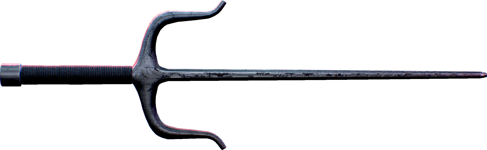
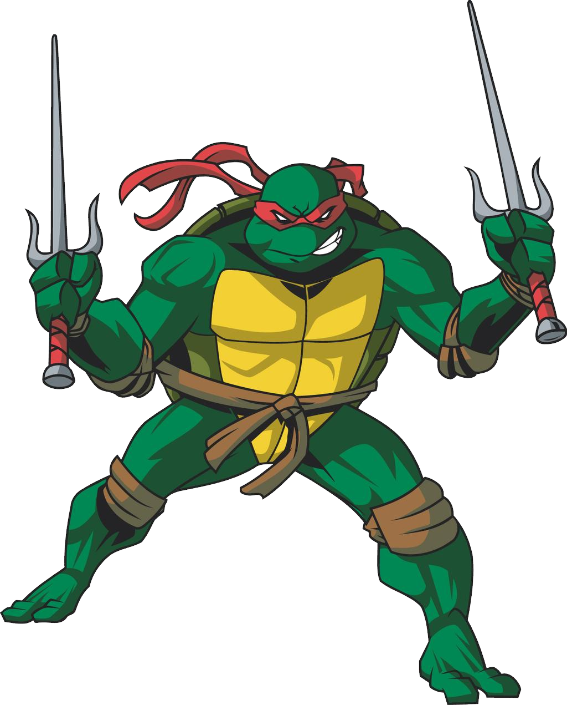
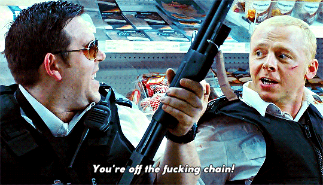

# Parts

The Sai ecosystem consists of three main components that work together to provide a comprehensive development experience for Cairo-based applications:

## Sai - Cairo Library and Macros

### A fork in (a) Dojo

  

Sai provides the core Cairo framework designed for maximum flexibility while remaining highly customizable for specific developer needs. The framework provides modular tools and macros that are loosely coupled, enabling developers to build applications without requiring deep understanding of the entire system architecture.

## Elektra - Deployment System

_(Or raphael?)_

  
  

Elektra is the universal deployment system that allows for easy deployment of smart contracts and their associated data structures. This system is designed to be modular and extensible with addons/plugins that can be used to extend its functionality and be easily modifiable to specific use cases.

## Angle - Off the Chain Indexer

_(Or Nick, Nicolas, Simon, Angel or Pegg)_

  

Angle provides off-chain indexing capabilities for Cairo applications, enabling efficient querying and analysis of on-chain data.

Each component is designed to be modular and can be used independently or together as part of a complete development stack.
